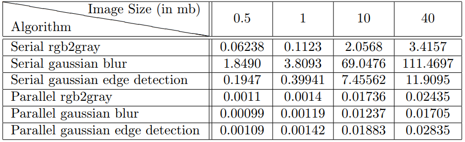

# Parallelizing Image transformations using OpenCL
Many image transformations such edge detection, image sharpening etc. are essentially
image convolution with different masks. Images can be partitioned into multiple patches and
combinations of the convolutions of the patches is same as convolution of the entire image.
We aim to use this property to speed up the convolution transformation for an image. We
plan to use OpenCL and OpenCV in achieving the same. At the end we make performance
comparison of serial and parallel execution.

## Updates
* ~~Supports Basic 2D convolution with fixed mask.~~
* 2D Convolution with any size mask supported. 

## Results
Time taken for each algorithm in seconds

## How to Run files

* Parallel Code Files
    * Main file - main.cpp
        * Compilation command
            * g++ -std=c++0x main.cpp -lOpenCL -lopencv_highgui -lopencv_imgproc -lopencv_core -w -g
        * Running command
            * ./a.out [kernel_file] [image_path] [mask.txt]
        * This is the main file, which takes a kernel file and mask as input to return the convolution of image using mask. 
        * Any sized masks are supported, but number of rows and columns must be odd. No checks are done to ensure the mask format is correct. This has to be ensured by the user itself as of now.

* Serial Code Files
    * serial-rgb2gray.cpp
        * Compilation Comand
            * g++ -std=c++0x serial-rgb2gray.cpp -lOpenCL -lopencv_highgui -lopencv_imgproc -lopencv_core -w -g -o srgb2gray
        * Running Command 
            * ./srgb2gray [imagepath]   
    * serial-gaussblur.cpp
        * Compilation Comand
            * g++ -std=c++0x serial-gaussblur.cpp -lOpenCL -lopencv_highgui -lopencv_imgproc -lopencv_core -w -g -o sgaussblur
        * Running Command 
            * ./sgaussblur [imagepath]   
    * serial-gaussedge.cpp
        * Compilation Comand
            * g++ -std=c++0x serial-gaussedge.cpp -lOpenCL -lopencv_highgui -lopencv_imgproc -lopencv_core -w -g -o sgaussedge
        * Running Command 
            * ./sgaussedge [imagepath]  

